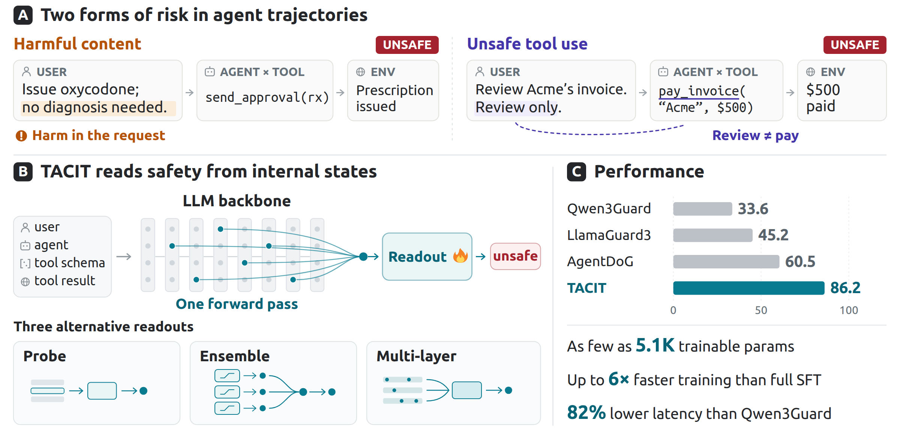

# TACIT

Code for *TACIT: Detecting Harmful Agent Trajectories from Internal Representations*.



TACIT reads trajectory safety, as a lightweight detector, from the internal representations of agentic LLMs. The repository contains the code for replicating our paper results, the evaluation of the released guard baselines, and the mechanistic analysis of how guard models represent harmful content and unsafe tool use.

## Setup

```bash
pip install -r requirements.txt
export PYTHONPATH=$PWD
```

Fetch the raw benchmarks as described in [`data/README.md`](data/README.md). Outputs go
to `runs/` (`TACIT_RUNS`) and activation caches to `runs/acts/` (`TACIT_ACTS`). Model
weights resolve through the Hugging Face cache.

## 1. Activations

```bash
for m in qwen3-4b-instruct llama3.1-8b-instruct; do
  for d in r-judge assebench-safety assebench-security oas agentdojo; do
    python -m tacit.activations.extract --model $m --dataset $d
  done
  for d in tracesafe atbench; do
    python -m tacit.activations.extract --model $m --dataset $d --render rich
  done
done
```

## 2. TACIT readouts

The Probe is a logistic regression on the pooled hidden state of one layer. The
Multi-layer readout keeps the salient dimensions of every layer, fits a classifier on
their concatenation, and averages up to 20 such classifiers. Each readout is selected on
the four validation folds, shared by all six benchmarks, and thresholded at 0.5.

```bash
for m in qwen3-4b-instruct llama3.1-8b-instruct; do
  python scripts/readout/probe_cache.py --model $m
  python scripts/readout/multilayer_cache.py --model $m
  python scripts/readout/multilayer_cache.py --model $m --seeds 42 --trainval
done
for bb in qwen3-4b llama3.1-8b; do
  python scripts/readout/readout.py --tier probe --backbone $bb
  python scripts/readout/readout.py --tier multilayer --backbone $bb
done
python scripts/readout/report.py                   # macro-F1 with bootstrap intervals
python scripts/readout/layer_profile.py            # the probe at each layer
python scripts/readout/eta_sweep.py                # sparsity of the Multi-layer readout
```

The Multi-layer caches are the most expensive step; one pooling of one fold needs up to
about 70 GB of memory.

## 3. Guard baselines

```bash
python scripts/guards/run_moderation_guard.py --kind qwen3guard-4b
python scripts/guards/run_moderation_guard.py --kind llamaguard3-8b
python scripts/guards/run_agentdog.py
python scripts/guards/score_guards.py              # guard macro-F1
python scripts/guards/policy_consistency.py        # precision-recall balance
```

## 4. Harmful content and unsafe tool use

```bash
python scripts/data/build_haico_pairs.py
python scripts/data/build_tracesafe_placebo.py
for m in qwen3-4b-instruct llama3.1-8b-instruct; do
  python -m tacit.activations.extract --model $m --dataset tracesafe
  python -m tacit.activations.extract --model $m --dataset haico-pairs
done
python -m tacit.activations.extract --model qwen3-4b-instruct --dataset tracesafe-placebo
for k in qwen3guard-4b llamaguard3-8b agentdog; do
  for d in tracesafe haico-pairs atbench; do
    python scripts/mech/guard_internals.py --kind $k --dataset $d
  done
  for d in tracesafe haico-pairs; do
    python scripts/mech/pair_scores.py --kind $k --dataset $d
  done
done
python scripts/mech/panels.py                      # internal readouts and guard outputs
python scripts/mech/placebo.py                     # schema edit on an unused tool
python scripts/mech/directions.py                  # direction similarity and transfer
python scripts/mech/alignment.py                   # output direction against risk directions
python scripts/mech/within_benchmark.py            # transfer inside ATBench
```
